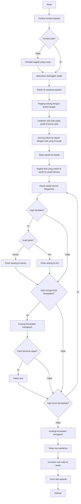

# Algoritma Mengoperasikan Sepeda Ontel/Kayuh

## Pseudocode
```
START
    // Persiapan sebelum mengendarai
    Periksa kondisi sepeda (ban, rem, rantai)
    IF kondisi sepeda tidak baik THEN
        Perbaiki bagian yang rusak
    END IF

    Sesuaikan ketinggian sadel
    Pastikan berdiri di samping sepeda

    // Naik ke sepeda
    Pegang setang dengan kedua tangan
    Letakkan satu kaki pada pedal di posisi atas
    Dorong tubuh ke depan dengan kaki yang masih di tanah

    // Mulai mengayuh
    Tekan pedal ke bawah dengan kaki yang sudah di pedal
    Angkat kaki yang masih di tanah ke pedal lainnya

    // Menjaga keseimbangan dan mengendarai
    WHILE ingin terus bersepeda DO
        Kayuh pedal secara bergantian
        Gunakan setang untuk mengarahkan sepeda

        IF ingin berbelok ke kanan THEN
            Putar setang ke kanan
        ELSE IF ingin berbelok ke kiri THEN
            Putar setang ke kiri
        END IF

        IF ingin mengurangi kecepatan THEN
            Kurangi kecepatan mengayuh
            IF perlu berhenti cepat THEN
                Tekan rem
            END IF
        END IF
    END WHILE

    // Berhenti
    Kurangi kecepatan mengayuh
    Tekan rem perlahan
    Ketika hampir berhenti, turunkan satu kaki ke tanah
    Turun dari sepeda
END
```

## Flowchart

