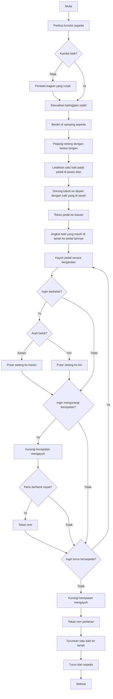

# Dokumentasi Proyek

## Essay 1: Algoritma Mengoperasikan Sepeda Ontel/Kayuh

### Pseudocode:
```
START
    // Persiapan sebelum mengendarai
    Periksa kondisi sepeda (ban, rem, rantai)
    IF kondisi sepeda tidak baik THEN
        Perbaiki bagian yang rusak
    END IF

    Sesuaikan ketinggian sadel
    Pastikan berdiri di samping sepeda

    // Naik ke sepeda
    Pegang setang dengan kedua tangan
    Letakkan satu kaki pada pedal di posisi atas
    Dorong tubuh ke depan dengan kaki yang masih di tanah

    // Mulai mengayuh
    Tekan pedal ke bawah dengan kaki yang sudah di pedal
    Angkat kaki yang masih di tanah ke pedal lainnya

    // Menjaga keseimbangan dan mengendarai
    WHILE ingin terus bersepeda DO
        Kayuh pedal secara bergantian
        Gunakan setang untuk mengarahkan sepeda

        IF ingin berbelok ke kanan THEN
            Putar setang ke kanan
        ELSE IF ingin berbelok ke kiri THEN
            Putar setang ke kiri
        END IF

        IF ingin mengurangi kecepatan THEN
            Kurangi kecepatan mengayuh
            IF perlu berhenti cepat THEN
                Tekan rem
            END IF
        END IF
    END WHILE

    // Berhenti
    Kurangi kecepatan mengayuh
    Tekan rem perlahan
    Ketika hampir berhenti, turunkan satu kaki ke tanah
    Turun dari sepeda
END
```

### Flowchart:


## Essay 2: Program C: Menghitung Luas Permukaan Tabung

### Deskripsi:
Program ini digunakan untuk menghitung **luas permukaan tabung** yang terdiri dari:
- **Luas alas** (lingkaran bawah)
- **Luas atap** (lingkaran atas)
- **Luas selimut**
- **Luas total permukaan**

Rumus yang digunakan:
- Luas alas = π × r²  
- Luas atap = π × r²  
- Luas selimut = 2 × π × r × t  
- Luas total = luas alas + luas atap + luas selimut  

dengan:
- `r` = jari-jari tabung
- `t` = tinggi tabung

### Source Code:
```c
#include <stdio.h>
#include <stdlib.h>

#define PHI 3.14

int main() {
    float r, t;
    float luasAlas, luasAtap, luasSelimut, luasTotal;

    // Input nilai jari-jari dan tinggi tabung
    printf("Masukkan jari-jari tabung (r): ");
    scanf("%f", &r);
    printf("Masukkan tinggi tabung (t): ");
    scanf("%f", &t);

    // Hitung luas alas (lingkaran bawah)
    luasAlas = PHI * r * r;

    // Hitung luas atap (lingkaran atas)
    luasAtap = PHI * r * r;

    // Hitung luas selimut tabung
    luasSelimut = 2 * PHI * r * t;

    // Hitung luas total permukaan tabung
    luasTotal = luasAlas + luasAtap + luasSelimut;

    // Tampilkan hasil
    printf("
Luas alas tabung: %.2f
", luasAlas);
    printf("Luas atap tabung: %.2f
", luasAtap);
    printf("Luas selimut tabung: %.2f
", luasSelimut);
    printf("Luas total kulit tabung: %.2f
", luasTotal);

    return 0;
}
```

### Contoh Input & Output:
```
Masukkan jari-jari tabung (r): 7
Masukkan tinggi tabung (t): 10

Luas alas tabung: 153.86
Luas atap tabung: 153.86
Luas selimut tabung: 439.60
Luas total kulit tabung: 747.32
```

## Essay 3: Dokumen Bisnis: Proses Perhitungan Deret Fibonacci

### Tujuan:  
Menghitung dan menampilkan deret Fibonacci berdasarkan jumlah elemen yang diminta oleh pengguna.

### Deskripsi Proses:  
1. **Input Pengguna**:  
   - Pengguna diminta untuk memasukkan jumlah elemen deret Fibonacci yang ingin dihitung.
   - Sistem menerima input ini sebagai nilai integer 'n', yang mewakili jumlah elemen dalam deret Fibonacci.

2. **Perhitungan Deret Fibonacci**:
   - Sistem akan menghitung elemen deret Fibonacci menggunakan rumus rekursif:
     - Jika 'n' kurang dari atau sama dengan 1, maka nilai deret Fibonacci adalah 'n'.
     - Jika lebih besar, maka nilai deret Fibonacci dihitung dengan menjumlahkan dua elemen sebelumnya (fibonacci(n-1) + fibonacci(n-2)).

3. **Output**:  
   - Sistem akan menampilkan deret Fibonacci sesuai dengan jumlah elemen yang diminta (hingga 'n').

### Langkah-langkah Pseudocode:

```
Program Fibonacci:
1. Mulai
2. Deklarasikan variabel 'n' sebagai integer.
3. Tampilkan pesan: "Masukkan jumlah deret Fibonacci:"
4. Terima input jumlah deret Fibonacci dari pengguna, simpan di 'n'.
5. Tampilkan pesan: "Deret Fibonacci hingga n adalah:"
6. Untuk setiap nilai 'i' dari 0 sampai n-1 lakukan langkah 7.
7. Tampilkan nilai Fibonacci untuk 'i'.
8. Selesai
```

### Flowchart:
1. Dimulai dengan menerima input jumlah deret Fibonacci.
2. Lakukan perhitungan berdasarkan rumus Fibonacci secara rekursif.
3. Tampilkan hasil deret Fibonacci yang dihitung.

### Tujuan Penggunaan:
- Menyediakan cara otomatis untuk menghitung deret Fibonacci dalam berbagai aplikasi pemrograman.
- Memudahkan pengguna dalam memperoleh informasi yang akurat mengenai deret Fibonacci.
